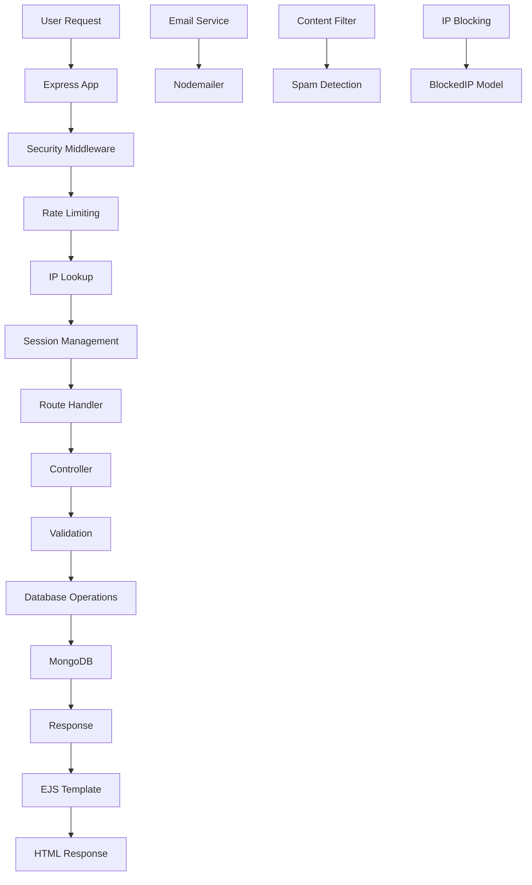
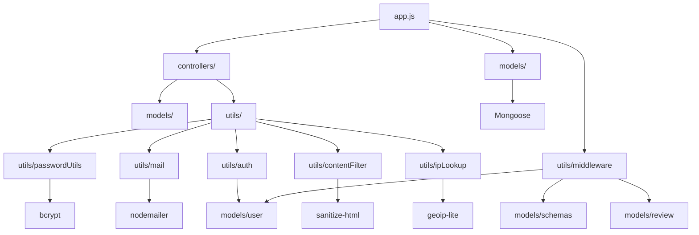

# Architecture Reference - longrunner Blog Application

## 1. System Overview

This is a Node.js/Express blog application built for blog.longrunner.co.uk, featuring user authentication, content management, and an interactive review system. The application serves as an Ironman training blog where users can read posts, leave reviews, and manage their accounts.

### Main Components:

- **Blog Content Management**: CRUD operations for blog posts
- **User Authentication**: Registration, login, password reset with role-based access
- **Review System**: User comments with spam filtering and moderation
- **Security Features**: Rate limiting, IP blocking, content sanitization
- **Admin Panel**: Content moderation and flagged review management

## 2. Architecture Flow

### Request Flow:

1. **Incoming Request** → Security middleware (Helmet, compression)
2. **Rate Limiting** → IP-based and user-based limits
3. **Authentication** → Session validation and user population
4. **Route Processing** → Controller handles business logic
5. **Data Validation** → Joi schemas and content filtering
6. **Database Operations** → Mongoose models interact with MongoDB
7. **Response Generation** → EJS templates render HTML
8. **Email Notifications** → Async email sending for important events

## 3. File/Module Inventory

### Core Application Files

#### `app.js` - Main Application Entry Point

- **Purpose**: Express server configuration and route setup
- **Key Responsibilities**:
  - Database connection setup
  - Middleware configuration (security, session, rate limiting)
  - Route registration
  - Error handling setup
- **Main Functions**: Server initialization on port 3004

### Models Layer (`models/`)

#### `models/user.js` - User Data Model

- **Purpose**: User authentication and management
- **Key Responsibilities**:
  - Password hashing and verification (bcrypt)
  - Passport-to-bcrypt migration support
  - Password reset token management
  - Role-based access control (user/admin)
- **Main Exports**: User model with authentication methods

#### `models/blogIM.js` - Blog Post Model

- **Purpose**: Blog content management
- **Key Responsibilities**:
  - Blog post structure definition
  - Review relationship management
- **Main Exports**: BlogIM model

#### `models/review.js` - Review Model

- **Purpose**: User comment management
- **Key Responsibilities**:
  - Review content storage
  - Spam flagging and scoring
  - IP and user agent tracking
- **Main Exports**: Review model

#### `models/schemas.js` - Validation Schemas

- **Purpose**: Input validation using Joi
- **Key Responsibilities**:
  - HTML sanitization extension
  - Form validation schemas
- **Main Exports**: Validation schemas for all forms

#### `models/blockedIP.js` - IP Blocking Model

- **Purpose**: Malicious IP address management
- **Key Responsibilities**:
  - Blocked IP array storage
- **Main Exports**: BlockedIP model

### Controllers Layer (`controllers/`)

#### `controllers/users.js` - User Management Controller

- **Purpose**: Handle all user-related operations
- **Key Responsibilities**:
  - User registration and login
  - Password reset functionality
  - User profile management
  - Account deletion
- **Main Functions**: register, login, forgot, reset, details, delete

#### `controllers/blogsIM.js` - Blog Management Controller

- **Purpose**: Blog post CRUD operations
- **Key Responsibilities**:
  - Blog post creation, reading, updating, deletion
  - Post sorting and pagination
- **Main Functions**: index, new, create, show, edit, update, delete

#### `controllers/reviews.js` - Review Management Controller

- **Purpose**: Review system and moderation
- **Key Responsibilities**:
  - Review creation and deletion
  - Spam detection and filtering
  - Admin moderation functions
- **Main Functions**: create, delete, flaggedReviews, updateFlaggedReview

### Utilities Layer (`utils/`)

#### `utils/auth.js` - Authentication Utilities

- **Purpose**: Custom authentication logic
- **Key Responsibilities**:
  - User authentication middleware
  - Session management (login/logout)
- **Main Functions**: authenticateUser, loginUser, logoutUser

#### `utils/middleware.js` - Request Middleware

- **Purpose**: Request processing middleware
- **Key Responsibilities**:
  - Input validation using Joi
  - Authorization checks (isLoggedIn, isAdmin, isReviewAuthor)
  - User population from session
- **Main Functions**: Validation functions, authorization middleware

#### `utils/passwordUtils.js` - Password Management

- **Purpose**: Password security utilities
- **Key Responsibilities**:
  - Password hashing (bcrypt)
  - Reset token generation
- **Main Functions**: hashPassword, comparePassword, generateResetToken

#### `utils/contentFilter.js` - Spam Detection

- **Purpose**: Content validation and spam filtering
- **Key Responsibilities**:
  - HTML sanitization
  - Spam pattern detection
  - Content scoring
- **Main Functions**: validateReview, detectSpam, sanitizeContent

#### `utils/rateLimiter.js` - Rate Limiting

- **Purpose**: API rate limiting
- **Key Responsibilities**:
  - Multiple rate limiters for different endpoints
  - IP and user-based limiting
- **Main Functions**: generalLimiter, authLimiter, passwordResetLimiter, registrationLimiter, reviewLimiter

#### `utils/mail.js` - Email Service

- **Purpose**: Email notification system
- **Key Responsibilities**:
  - SMTP configuration (Zoho)
  - Email sending functionality
- **Main Functions**: mail function for sending notifications

#### `utils/ipLookup.js` - Geolocation

- **Purpose**: IP address geolocation
- **Key Responsibilities**:
  - IP geolocation using geoip-lite
  - Country and city lookup
- **Main Functions**: reviewIp

#### `utils/catchAsync.js` - Async Error Handling

- **Purpose**: Async function error wrapper
- **Key Responsibilities**:
  - Catch async errors and pass to error handler

#### `utils/ExpressError.js` - Custom Error Class

- **Purpose**: Custom error handling
- **Key Responsibilities**:
  - Structured error creation

### Views Layer (`views/`)

#### `views/layouts/boilerplate.ejs` - Main Layout

- **Purpose**: Base HTML template
- **Key Responsibilities**:
  - Common HTML structure
  - Navigation and footer inclusion

#### `views/partials/` - Reusable Components

- **Purpose**: Template partials
- **Key Responsibilities**:
  - Navigation bar
  - Flash messages
  - Footer

#### `views/blogim/` - Blog Views

- **Purpose**: Blog-related templates
- **Files**: index.ejs, show.ejs, new.ejs, edit.ejs

#### `views/users/` - User Views

- **Purpose**: User authentication templates
- **Files**: login.ejs, register.ejs, forgot.ejs, reset.ejs, details.ejs, deletepre.ejs

#### `views/admin/` - Admin Views

- **Purpose**: Administrative interface
- **Files**: flaggedReviews.ejs

### Static Assets (`public/`)

#### `public/stylesheets/` - CSS Styles

- **Purpose**: Styling for different pages
- **Files**: Page-specific CSS files

## 4. Dependency Map

### Core Dependencies Flow:

### Key Import Relationships:

#### app.js imports:

- `controllers/users.js`
- `controllers/reviews.js`
- `controllers/blogsIM.js`
- `utils/middleware.js`
- `utils/rateLimiter.js`
- `utils/ipMiddleware.js`
- `models/user.js`
- `models/blockedIP.js`

#### Controller imports:

- All controllers import their respective models
- `utils/catchAsync.js` for error handling
- `utils/mail.js` for notifications
- `utils/passwordUtils.js` for auth
- `utils/contentFilter.js` for spam detection

#### Model imports:

- `utils/passwordUtils.js` (user model)
- `mongoose` (all models)

#### Utils imports:

- `models/schemas.js` (middleware)
- `models/user.js` (auth, middleware)
- External libraries for specific functionality

### Entry Points:

- **Main Entry**: `app.js` (port 3004)
- **Model Entry Points**: Each model file exports a Mongoose model
- **Controller Entry Points**: Each controller exports route handler functions
- **Utility Entry Points**: Each utility exports specific functionality

### Circular Dependencies:

- **None detected** - The architecture follows a clean layered approach

## 5. Data Flow

### User Registration Flow:

1. **Input** → Registration form data
2. **Validation** → Joi schema validation (`middleware.js:validateRegister`)
3. **Processing** → `users.js:registerPost`
4. **Password Hashing** → `passwordUtils.js:hashPassword`
5. **Database** → User model creation (`models/user.js`)
6. **Session** → Login user (`auth.js:loginUser`)
7. **Notification** → Email sent (`mail.js`)
8. **Response** → Redirect to blog with success message

### Blog Post Creation Flow:

1. **Authorization** → Admin check (`middleware.js:isAdmin`)
2. **Input** → Blog post form data
3. **Processing** → `blogsIM.js:create`
4. **Database** → BlogIM model creation
5. **Response** → Redirect to new post

### Review Creation Flow:

1. **Input** → Review form data
2. **Rate Limiting** → `rateLimiter.js:reviewLimiter`
3. **Content Filtering** → `contentFilter.js:validateReview`
4. **Spam Detection** → Pattern matching and scoring
5. **IP Tracking** → `ipLookup.js:reviewIp`
6. **Database** → Review model creation + BlogIM update
7. **Notification** → Email to admin
8. **Response** → Redirect with success/error message

### Authentication Flow:

1. **Input** → Login credentials
2. **Rate Limiting** → `rateLimiter.js:authLimiter`
3. **Validation** → Joi schema validation
4. **Authentication** → `auth.js:authenticateUser`
5. **Password Verification** → `models/user.js:authenticate`
6. **Session** → `auth.js:loginUser`
7. **Response** → Redirect to intended page

## 6. Key Interactions

### Most Important File Interactions:

#### 1. User Authentication System:

- `app.js:212-218` → `utils/auth.js:authenticateUser` → `models/user.js:authenticate`
- **Critical Path**: Login request → Authentication → Session creation

#### 2. Content Moderation System:

- `controllers/reviews.js:create` → `utils/contentFilter.js:validateReview` → `models/review.js`
- **Critical Path**: Review submission → Spam detection → Database storage

#### 3. Admin Review Moderation:

- `app.js:237-238` → `controllers/reviews.js:flaggedReviews` → `views/admin/flaggedReviews.ejs`
- **Critical Path**: Admin access → Flagged reviews display → Moderation actions

#### 4. Password Reset System:

- `controllers/users.js:forgotPost` → `utils/passwordUtils.js:generateResetToken` → `models/user.js`
- **Critical Path**: Reset request → Token generation → Email sending

#### 5. Security Middleware Chain:

- `app.js:95-180` → Multiple security layers (Helmet, rate limiting, IP blocking)
- **Critical Path**: Every request passes through security checks

### Common User Flows:

#### Reading Blog Posts:

1. `GET /blogim` → `blogsIM.js:index` → Database query → `views/blogim/index.ejs`
2. `GET /blogim/:id` → `blogsIM.js:show` → Populate reviews → `views/blogim/show.ejs`

#### User Account Management:

1. Registration: `GET/POST /register` → `users.js:register/registerPost`
2. Login: `GET/POST /login` → `users.js:login` + `app.js:212-218`
3. Profile Update: `GET/POST /details` → `users.js:details/detailsPost`

#### Content Management (Admin):

1. Create Post: `GET/POST /blogim/pBsy6S3RgVhPg48HWZH7keaTI3EcwknE` → `blogsIM.js:new/create`
2. Moderate Reviews: `GET /admin/flagged-reviews` → `reviews.js:flaggedReviews`

## 7. Extension Points

### Where to Add New Features:

#### 1. New Blog Features:

- **Files to Modify**:
  - `models/blogIM.js` - Add new fields to schema
  - `controllers/blogsIM.js` - Add new controller methods
  - `views/blogim/` - Add new EJS templates
  - `app.js` - Add new routes
- **Integration Points**: Extend existing CRUD operations

#### 2. New User Roles:

- **Files to Modify**:
  - `models/user.js` - Update role enum
  - `utils/middleware.js` - Add new authorization functions
  - `controllers/` - Add role-specific logic
- **Integration Points**: Leverage existing role system

#### 3. New Content Types:

- **Files to Modify**:
  - `models/` - Create new model files
  - `controllers/` - Create new controller files
  - `views/` - Create new view directories
  - `app.js` - Add new route groups
- **Integration Points**: Follow existing MVC pattern

#### 4. Enhanced Security Features:

- **Files to Modify**:
  - `utils/` - Add new utility modules
  - `app.js` - Add new middleware
  - `models/` - Add security-related models
- **Integration Points**: Extend existing security middleware chain

#### 5. API Endpoints:

- **Files to Modify**:
  - `app.js` - Add API routes
  - `controllers/` - Add API controllers (or create separate API controller directory)
  - `utils/middleware.js` - Add API-specific middleware
- **Integration Points**: Leverage existing models and utilities

### Modification Guidelines:

#### For New Database Entities:

1. Create model in `models/` directory
2. Create corresponding controller in `controllers/`
3. Add validation schemas in `models/schemas.js`
4. Create views in `views/` directory
5. Add routes in `app.js`
6. Add any required middleware in `utils/middleware.js`

#### For New User Features:

1. Update `models/user.js` if schema changes needed
2. Add validation in `models/schemas.js`
3. Implement logic in `controllers/users.js`
4. Create/update views in `views/users/`
5. Add routes in `app.js`
6. Update middleware if authorization needed

#### For Security Enhancements:

1. Add utilities in `utils/` directory
2. Integrate middleware in `app.js`
3. Update models if new security data needed
4. Add admin controls if applicable

### Configuration Points:

- **Environment Variables**: `.env` file for database, email, and security settings
- **Rate Limiting**: `utils/rateLimiter.js` for adjusting limits
- **Content Filtering**: `utils/contentFilter.js` for spam detection rules
- **Email Configuration**: `utils/mail.js` for SMTP settings

This architecture provides a solid foundation for extending the application while maintaining security, performance, and code organization standards.
