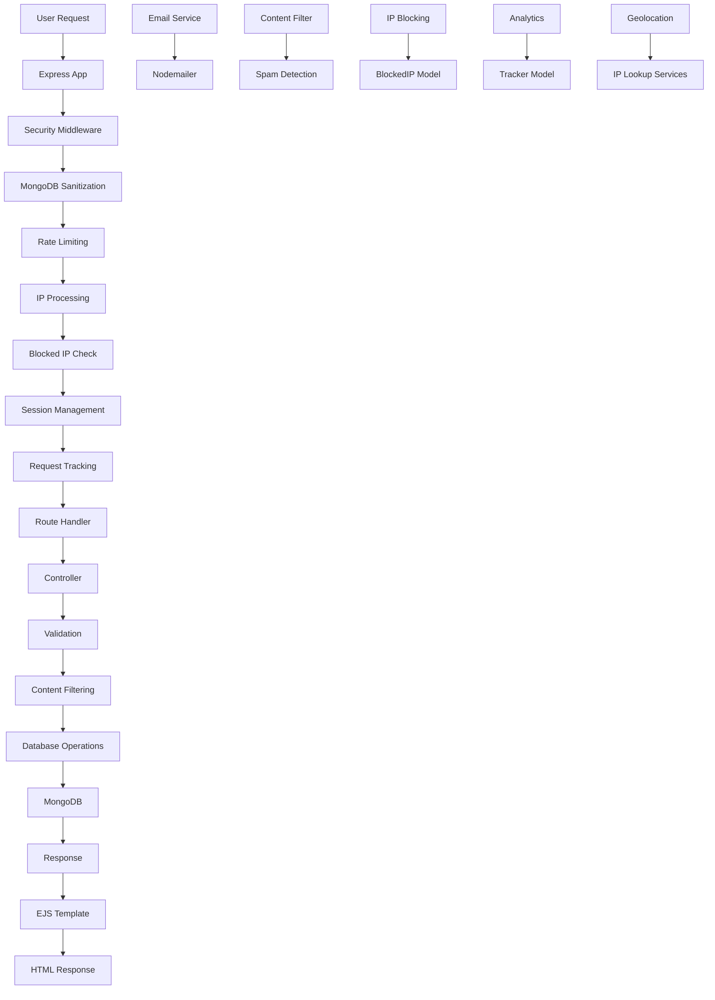
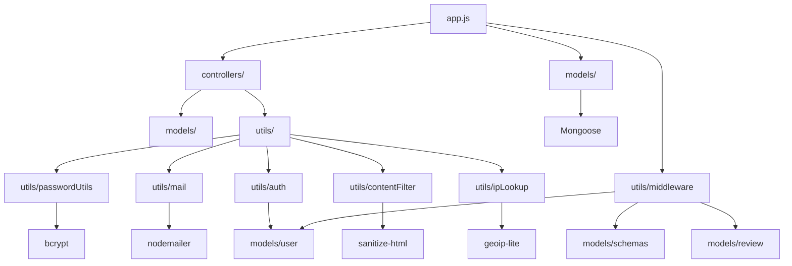
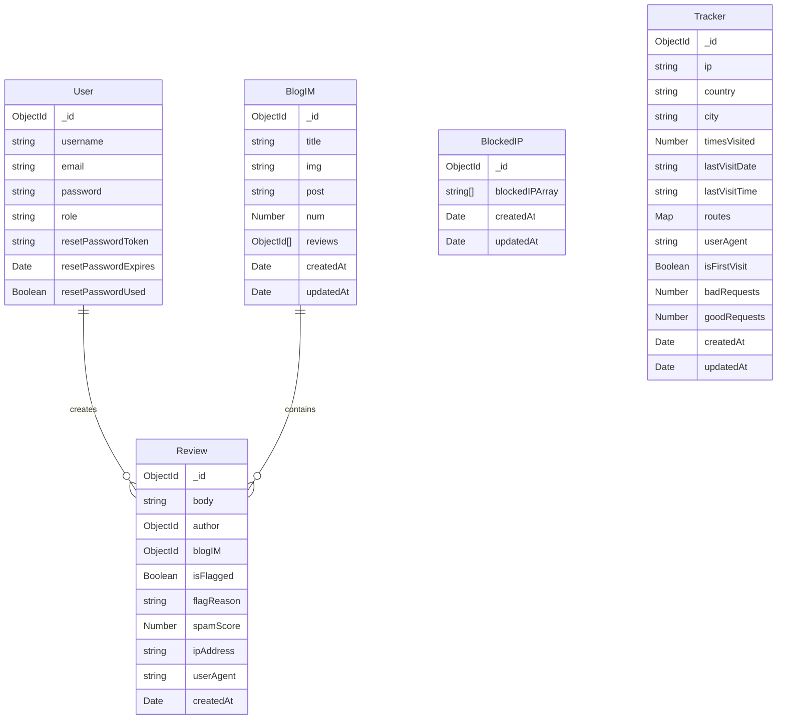

# Architecture Reference - longrunner Blog Application

## 1. System Overview

This is a Node.js/Express blog application built for blog.longrunner.co.uk, featuring user authentication, content management, and an interactive review system. The application serves as an Ironman training blog where users can read posts, leave reviews, and manage their accounts.

### Main Components:

- **Blog Content Management**: CRUD operations for blog posts
- **User Authentication**: Registration, login, password reset with role-based access
- **Review System**: User comments with spam filtering and moderation
- **Security Features**: Rate limiting, IP blocking, content sanitization
- **Admin Panel**: Content moderation and flagged review management

## 2. Architecture Flow

### Request Flow:

1. **Incoming Request** → Security middleware (Helmet, compression)
2. **MongoDB Sanitization** → Custom middleware to prevent injection attacks
3. **Rate Limiting** → IP-based and user-based limits
4. **IP Processing** → IP extraction, geolocation, and blocked IP checking
5. **Session Management** → Session validation and user population
6. **Request Tracking** → Analytics middleware for visitor tracking
7. **Route Processing** → Controller handles business logic
8. **Data Validation** → Joi schemas and advanced content filtering
9. **Database Operations** → Mongoose models interact with MongoDB
10. **Response Generation** → EJS templates render HTML
11. **Email Notifications** → Async email sending for important events

## 3. File/Module Inventory

### Core Application Files

#### `app.js` - Main Application Entry Point

- **Purpose**: Express server configuration and route setup
- **Key Responsibilities**:
  - Database connection setup
  - Middleware configuration (security, session, rate limiting)
  - Route registration
  - Error handling setup
- **Main Functions**: Server initialization on port 3004

### Models Layer (`models/`)

#### `models/user.js` - User Data Model

- **Purpose**: User authentication and management
- **Key Responsibilities**:
  - Password hashing and verification (bcrypt)
  - Passport-to-bcrypt migration support
  - Password reset token management
  - Role-based access control (user/admin)
- **Main Exports**: User model with authentication methods

#### `models/blogIM.js` - Blog Post Model

- **Purpose**: Blog content management
- **Key Responsibilities**:
  - Blog post structure definition
  - Review relationship management
- **Main Exports**: BlogIM model

#### `models/review.js` - Review Model

- **Purpose**: User comment management
- **Key Responsibilities**:
  - Review content storage
  - Spam flagging and scoring
  - IP and user agent tracking
- **Main Exports**: Review model

#### `models/schemas.js` - Validation Schemas

- **Purpose**: Input validation using Joi
- **Key Responsibilities**:
  - HTML sanitization extension
  - Form validation schemas
- **Main Exports**: Validation schemas for all forms

#### `models/blockedIP.js` - IP Blocking Model

- **Purpose**: Malicious IP address management
- **Key Responsibilities**:
  - Blocked IP array storage
  - Dynamic IP blocking with caching
- **Main Exports**: BlockedIP model

#### `models/tracker.js` - Request Analytics Model

- **Purpose**: Visitor tracking and analytics
- **Key Responsibilities**:
  - IP-based visitor tracking
  - Route visitation counting
  - Geographic location storage
  - Good/bad request categorization
  - User agent tracking
- **Main Exports**: Tracker model with Map-based route storage

### Controllers Layer (`controllers/`)

#### `controllers/users.js` - User Management Controller

- **Purpose**: Handle all user-related operations
- **Key Responsibilities**:
  - User registration and login
  - Password reset functionality
  - User profile management
  - Account deletion
- **Main Functions**: register, login, forgot, reset, details, delete

#### `controllers/blogsIM.js` - Blog Management Controller

- **Purpose**: Blog post CRUD operations
- **Key Responsibilities**:
  - Blog post creation, reading, updating, deletion
  - Post sorting and pagination
- **Main Functions**: index, new, create, show, edit, update, delete

#### `controllers/reviews.js` - Review Management Controller

- **Purpose**: Review system and moderation
- **Key Responsibilities**:
  - Review creation and deletion
  - Spam detection and filtering
  - Admin moderation functions
- **Main Functions**: create, delete, flaggedReviews, updateFlaggedReview

#### `controllers/admin.js` - Admin Panel Controller

- **Purpose**: Administrative interface
- **Key Responsibilities**:
  - Admin dashboard
  - Post management
  - Review moderation
  - User management
- **Main Functions**: dashboard, posts, flaggedReviews, allReviews

#### `controllers/policy.js` - Policy Controller

- **Purpose**: Legal policy pages
- **Key Responsibilities**:
  - Cookie policy
  - Terms and conditions
  - Privacy policy
- **Main Functions**: cookiePolicy, tandc, logs

### Utilities Layer (`utils/`)

#### `utils/auth.js` - Authentication Utilities

- **Purpose**: Custom authentication logic
- **Key Responsibilities**:
  - User authentication middleware
  - Session management (login/logout)
- **Main Functions**: authenticateUser, loginUser, logoutUser

#### `utils/middleware.js` - Request Middleware

- **Purpose**: Request processing middleware
- **Key Responsibilities**:
  - Input validation using Joi
  - Authorization checks (isLoggedIn, isAdmin, isReviewAuthor)
  - User population from session
- **Main Functions**: Validation functions, authorization middleware

#### `utils/passwordUtils.js` - Password Security

- **Purpose**: Password security utilities with bcrypt
- **Key Responsibilities**:
  - Password hashing (12 salt rounds for security)
  - Password verification
  - Cryptographically secure reset token generation
  - Reset token expiry calculation (1 hour)
- **Main Functions**: hashPassword, comparePassword, generateResetToken, generateResetTokenExpiry

#### `utils/contentFilter.js` - Advanced Spam Detection

- **Purpose**: Content validation and sophisticated spam filtering
- **Key Responsibilities**:
  - HTML sanitization (no tags allowed)
  - Multi-category spam pattern detection:
    - URL detection (including obscure TLDs)
    - Promotional keyword filtering
    - Contact information detection
    - Repetitive content analysis
    - Suspicious pattern matching
  - Content scoring system (threshold: 3 points)
  - Invisible character removal
  - Length and capitalization analysis
- **Main Functions**: validateReview, detectSpam, sanitizeContent, getSpamErrorMessage
- **Scoring**: URLs (3pts), Promotional (2pts), Contact (4pts), Repetitive (1pts), Suspicious (5pts), Obscure websites (8pts)

#### `utils/rateLimiter.js` - Multi-Tier Rate Limiting

- **Purpose**: Comprehensive API rate limiting system
- **Key Responsibilities**:
  - Endpoint-specific rate limiting strategies
  - IP-based and user-based limiting
  - Success request skipping for auth endpoints
  - Dynamic key generation for logged-in vs anonymous users
- **Main Functions**:
  - generalLimiter: 200 requests/15min (all endpoints)
  - authLimiter: 10 attempts/15min (login)
  - passwordResetLimiter: 5 attempts/hour (password reset)
  - registrationLimiter: 5 attempts/hour (registration)
  - reviewLimiter: 3 reviews/15min (content submission)

#### `utils/mail.js` - Email Service

- **Purpose**: Email notification system via Zoho SMTP
- **Key Responsibilities**:
  - SMTP configuration (Zoho EU servers)
  - Secure email transmission (port 465, SSL)
  - Dynamic recipient handling
  - Admin notification system
- **Main Functions**: mail function for sending notifications
- **Configuration**: Uses EMAIL_USER, ALIAS_EMAIL, ZOHOPW environment variables

#### `utils/ipLookup.js` - Geolocation Service

- **Purpose**: IP address geolocation with fallback services
- **Key Responsibilities**:
  - Primary geolocation using geoip-lite (local, fast)
  - Fallback to ip-api.com (external service)
  - Development mode with random IP simulation
  - IPv6 to IPv4 address normalization
  - Country name resolution using country-list
- **Main Functions**: reviewIp

#### `utils/ipMiddleware.js` - IP Middleware

- **Purpose**: IP tracking and blocking
- **Key Responsibilities**:
  - IP address extraction
  - Blocked IP checking
- **Main Functions**: getIpInfoMiddleware

#### `utils/catchAsync.js` - Async Error Handling

- **Purpose**: Async function error wrapper
- **Key Responsibilities**:
  - Catch async errors and pass to error handler

#### `utils/ExpressError.js` - Custom Error Class

- **Purpose**: Custom error handling
- **Key Responsibilities**:
  - Structured error creation

#### `utils/errorHandler.js` - Error Handler

- **Purpose**: Centralized error handling
- **Key Responsibilities**:
  - Error logging and response formatting

#### `utils/trackerLog.js` - Request Logging

- **Purpose**: Request tracking and logging
- **Key Responsibilities**:
  - Request logging for analytics
- **Main Functions**: myLogger

#### `utils/tracker.js` - Analytics Middleware

- **Purpose**: Real-time visitor analytics
- **Key Responsibilities**:
  - IP-based visitor tracking
  - Route visitation analytics
  - Geographic data collection
  - Request success/failure tracking
  - First-time visitor detection
- **Main Functions**: trackRequest

#### `utils/blockedIPMiddleware.js` - IP Blocking System

- **Purpose**: Dynamic IP blocking with caching
- **Key Responsibilities**:
  - Blocked IP cache management (5-minute TTL)
  - Real-time IP blocking checks
  - IPv6 to IPv4 address normalization
  - Cache optimization for performance
- **Main Functions**: checkBlockedIP, blockIP, unblockIP, getBlockedIPs, updateBlockedIPCache

#### `utils/ipMiddleware.js` - IP Information Extraction

- **Purpose**: IP address processing and information extraction
- **Key Responsibilities**:
  - Client IP address extraction
  - Proxy-aware IP detection
  - IP information attachment to request object
- **Main Functions**: getIpInfoMiddleware

### Views Layer (`views/`)

#### `views/layouts/boilerplate.ejs` - Main Layout

- **Purpose**: Base HTML template
- **Key Responsibilities**:
  - Common HTML structure
  - Navigation and footer inclusion

#### `views/partials/` - Reusable Components

- **Purpose**: Template partials
- **Key Responsibilities**:
  - Navigation bar
  - Flash messages
  - Footer

#### `views/blogim/` - Blog Views

- **Purpose**: Blog-related templates
- **Files**: index.ejs, show.ejs

#### `views/users/` - User Views

- **Purpose**: User authentication templates
- **Files**: login.ejs, register.ejs, forgot.ejs, reset.ejs, details.ejs, deletepre.ejs

#### `views/admin/` - Admin Views

- **Purpose**: Administrative interface
- **Files**: dashboard.ejs, posts.ejs, new.ejs, edit.ejs, flaggedReviews.ejs, allReviews.ejs

#### `views/policy/` - Policy Views

- **Purpose**: Legal policy templates
- **Files**: cookiePolicy.ejs, tandc.ejs, error.ejs, sitemap.xml

### Static Assets (`public/`)

#### `public/stylesheets/` - CSS Styles

- **Purpose**: Styling for different pages
- **Files**: Page-specific CSS files

#### `public/javascripts/` - Client-side Scripts

- **Purpose**: Frontend interactivity
- **Files**: Form validation, UI interactions

#### `public/images/` - Image Assets

- **Purpose**: Static images and media
- **Files**: Post images, UI graphics

## 4. Dependency Map

### Core Dependencies Flow:

### Key Import Relationships:

#### app.js imports:

- `controllers/users.js`
- `controllers/reviews.js`
- `controllers/blogsIM.js`
- `controllers/admin.js`
- `controllers/policy.js`
- `utils/middleware.js`
- `utils/rateLimiter.js`
- `utils/ipMiddleware.js`
- `utils/auth.js`
- `utils/tracker.js`
- `utils/blockedIPMiddleware.js`
- `models/user.js`
- `models/blockedIP.js`

#### Controller imports:

- All controllers import their respective models
- `utils/catchAsync.js` for error handling
- `utils/mail.js` for notifications
- `utils/passwordUtils.js` for auth
- `utils/contentFilter.js` for spam detection
- `utils/ipLookup.js` for geolocation (reviews controller)
- `utils/blockedIPMiddleware.js` for IP management (admin, reviews controllers)

#### Model imports:

- `utils/passwordUtils.js` (user model)
- `mongoose` (all models)

#### Utils imports:

- `models/schemas.js` (middleware)
- `models/user.js` (auth, middleware)
- External libraries for specific functionality

### Entry Points:

- **Main Entry**: `app.js` (port 3004)
- **Model Entry Points**: Each model file exports a Mongoose model
- **Controller Entry Points**: Each controller exports route handler functions
- **Utility Entry Points**: Each utility exports specific functionality

### Circular Dependencies:

- **None detected** - The architecture follows a clean layered approach

## 5. Data Flow

### User Registration Flow:

1. **Input** → Registration form data
2. **Validation** → Joi schema validation (`middleware.js:validateRegister`)
3. **Processing** → `users.js:registerPost`
4. **Password Hashing** → `passwordUtils.js:hashPassword`
5. **Database** → User model creation (`models/user.js`)
6. **Session** → Login user (`auth.js:loginUser`)
7. **Notification** → Email sent (`mail.js`)
8. **Response** → Redirect to blog with success message

### Blog Post Creation Flow:

1. **Authorization** → Admin check (`middleware.js:isAdmin`)
2. **Input** → Blog post form data
3. **Processing** → `admin.js:createPost`
4. **Database** → BlogIM model creation
5. **Response** → Redirect to posts list

### Review Creation Flow:

1. **Input** → Review form data
2. **Rate Limiting** → `rateLimiter.js:reviewLimiter`
3. **Content Filtering** → `contentFilter.js:validateReview`
4. **Spam Detection** → Advanced pattern matching and scoring
5. **IP Tracking** → `ipLookup.js:reviewIp` (with fallback services)
6. **IP Blocking Check** → `blockedIPMiddleware.js` for high-score spam
7. **Database** → Review model creation + BlogIM update (if not flagged)
8. **Admin Notification** → Email for flagged content
9. **Response** → Redirect with success/error message

### Authentication Flow:

1. **Input** → Login credentials
2. **Rate Limiting** → `rateLimiter.js:authLimiter`
3. **Validation** → Joi schema validation
4. **Authentication** → `auth.js:authenticateUser`
5. **Password Verification** → `models/user.js:authenticate`
6. **Session** → `auth.js:loginUser`
7. **Response** → Redirect to intended page

## 6. Key Interactions

### Most Important File Interactions:

#### 1. User Authentication System:

- `app.js:240-252` → `utils/auth.js:authenticateUser` → `models/user.js:authenticate`
- **Critical Path**: Login request → Authentication → Session creation

#### 2. Content Moderation System:

- `controllers/reviews.js:create` → `utils/contentFilter.js:validateReview` → `models/review.js`
- **Critical Path**: Review submission → Spam detection → Database storage

#### 3. Admin Review Moderation:

- `app.js:289-300` → `controllers/admin.js:flaggedReviews` → `views/admin/flaggedReviews.ejs`
- **Critical Path**: Admin access → Flagged reviews display → Moderation actions

#### 4. Password Reset System:

- `controllers/users.js:forgotPost` → `utils/passwordUtils.js:generateResetToken` → `models/user.js`
- **Critical Path**: Reset request → Token generation → Email sending

#### 5. Security Middleware Chain:

- `app.js:95-220` → Multiple security layers (Helmet, MongoDB sanitization, rate limiting, IP processing, blocking)
- **Critical Path**: Every request passes through comprehensive security checks
- **Components**: Security headers, injection prevention, rate limiting, geolocation, IP blocking, analytics tracking

### Common User Flows:

#### Reading Blog Posts:

1. `GET /blogim` → `blogsIM.js:index` → Database query → `views/blogim/index.ejs`
2. `GET /blogim/:id` → `blogsIM.js:show` → Populate reviews → `views/blogim/show.ejs`

#### User Account Management:

1. Registration: `GET/POST /auth/register` → `users.js:register/registerPost`
2. Login: `GET/POST /auth/login` → `users.js:login` + `app.js:240-252`
3. Profile Update: `GET/POST /auth/details` → `users.js:details/detailsPost`

#### Content Management (Admin):

1. Create Post: `GET/POST /admin/posts/new` → `admin.js:newPost/createPost`
2. Moderate Reviews: `GET /admin/flagged-reviews` → `admin.js:flaggedReviews`

## 7. Extension Points

### Where to Add New Features:

#### 1. New Blog Features:

- **Files to Modify**:
  - `models/blogIM.js` - Add new fields to schema
  - `controllers/admin.js` - Add new controller methods
  - `views/admin/` - Add new EJS templates
  - `app.js` - Add new routes
- **Integration Points**: Extend existing CRUD operations

#### 2. New User Roles:

- **Files to Modify**:
  - `models/user.js` - Update role enum
  - `utils/middleware.js` - Add new authorization functions
  - `controllers/` - Add role-specific logic
- **Integration Points**: Leverage existing role system

#### 3. New Content Types:

- **Files to Modify**:
  - `models/` - Create new model files
  - `controllers/` - Create new controller files
  - `views/` - Create new view directories
  - `app.js` - Add new route groups
- **Integration Points**: Follow existing MVC pattern

#### 4. Enhanced Security Features:

- **Files to Modify**:
  - `utils/` - Add new utility modules
  - `app.js` - Add new middleware
  - `models/` - Add security-related models
- **Integration Points**: Extend existing security middleware chain

#### 5. API Endpoints:

- **Files to Modify**:
  - `app.js` - Add API routes
  - `controllers/` - Add API controllers (or create separate API controller directory)
  - `utils/middleware.js` - Add API-specific middleware
- **Integration Points**: Leverage existing models and utilities

### Modification Guidelines:

#### For New Database Entities:

1. Create model in `models/` directory
2. Create corresponding controller in `controllers/`
3. Add validation schemas in `models/schemas.js`
4. Create views in `views/` directory
5. Add routes in `app.js`
6. Add any required middleware in `utils/middleware.js`

#### For New User Features:

1. Update `models/user.js` if schema changes needed
2. Add validation in `models/schemas.js`
3. Implement logic in `controllers/users.js`
4. Create/update views in `views/users/`
5. Add routes in `app.js`
6. Update middleware if authorization needed

#### For Security Enhancements:

1. Add utilities in `utils/` directory
2. Integrate middleware in `app.js`
3. Update models if new security data needed
4. Add admin controls if applicable

### Configuration Points:

- **Environment Variables**: `.env` file for database, email, and security settings
- **Rate Limiting**: `utils/rateLimiter.js` for adjusting limits
- **Content Filtering**: `utils/contentFilter.js` for spam detection rules
- **Email Configuration**: `utils/mail.js` for SMTP settings
- **IP Blocking**: `utils/blockedIPMiddleware.js` for cache TTL (5 minutes)
- **Analytics**: `utils/tracker.js` for visitor tracking configuration
- **Geolocation**: `utils/ipLookup.js` for fallback service configuration

## 8. Security Architecture

### Multi-Layer Security Approach:

1. **Application Layer**:
   - Helmet.js for security headers
   - Express compression for performance
   - Custom MongoDB injection prevention

2. **Network Layer**:
   - IP-based rate limiting
   - Geographic IP tracking
   - Dynamic IP blocking with caching

3. **Authentication Layer**:
   - bcrypt password hashing (12 rounds)
   - Session management with secure cookies
   - Passport-to-bcrypt migration support

4. **Content Layer**:
   - Advanced spam detection with scoring
   - HTML sanitization
   - Input validation with Joi

5. **Monitoring Layer**:
   - Request analytics and tracking
   - Failed request monitoring
   - Geographic visitor analysis

### Security Features:

- **Rate Limiting**: Tiered limits by endpoint type
- **IP Blocking**: Automatic blocking for high spam scores (≥10)
- **Content Filtering**: Multi-category spam detection
- **Session Security**: HTTP-only, secure cookies with sameSite strict
- **Input Sanitization**: MongoDB query injection prevention
- **Password Security**: Strong bcrypt hashing with salt rounds

## 9. Database Schema Relationships

### Entity Relationship Diagram:

### Key Relationships:

1. **User → Review**: One-to-many relationship (user can create multiple reviews)
2. **BlogIM → Review**: One-to-many relationship (blog post can have multiple reviews)
3. **Review → User**: Many-to-one relationship (review belongs to one user)
4. **Review → BlogIM**: Many-to-one relationship (review belongs to one blog post)

### Database Indexes:

- **User**: Unique indexes on `username` and `email`
- **Tracker**: Compound index on `ip` and `lastVisitDate` for performance
- **Review**: Indexes on `blogIM`, `author`, and `isFlagged` for queries

## 10. Performance Optimizations

### Caching Strategies:

1. **IP Blocking Cache**: 5-minute TTL to reduce database queries
2. **Session Store**: MongoDB-based session storage for persistence
3. **Static Asset Caching**: Express static middleware with appropriate headers

### Database Optimizations:

1. **Selective Field Loading**: Password fields use `select: false` for security
2. **Lean Queries**: Use lean() for read-only operations where possible
3. **Index Optimization**: Strategic indexes on frequently queried fields

### Request Processing:

1. **Compression**: Gzip compression for all responses
2. **Security Headers**: Helmet.js for optimized security headers
3. **Rate Limiting**: Memory-based rate limiting for performance

## 11. Development vs Production Configuration

### Development Mode:

- Random IP simulation for testing (`utils/ipLookup.js`)
- Detailed error messages in validation
- Console logging for debugging
- Environment variable loading with dotenv

### Production Mode:

- Real IP geolocation
- Generic error messages for security
- Trust proxy configuration for nginx
- Secure cookie settings
- Optimized error handling

### Environment Variables:

- `NODE_ENV`: Development/production mode
- `MONGODB`: Database connection string
- `SESSION_KEY`: Session encryption key
- `EMAIL_USER`, `ZOHOPW`: Email configuration
- `SITEKEY`, `SECRETKEY`: reCAPTCHA configuration
- `MONGODB_URI`: Alternative database URL

This architecture provides a solid foundation for extending the application while maintaining security, performance, and code organization standards.
